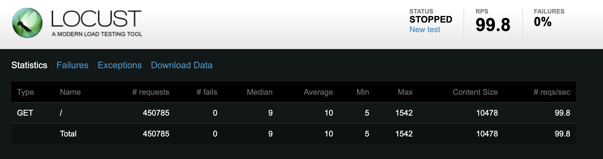
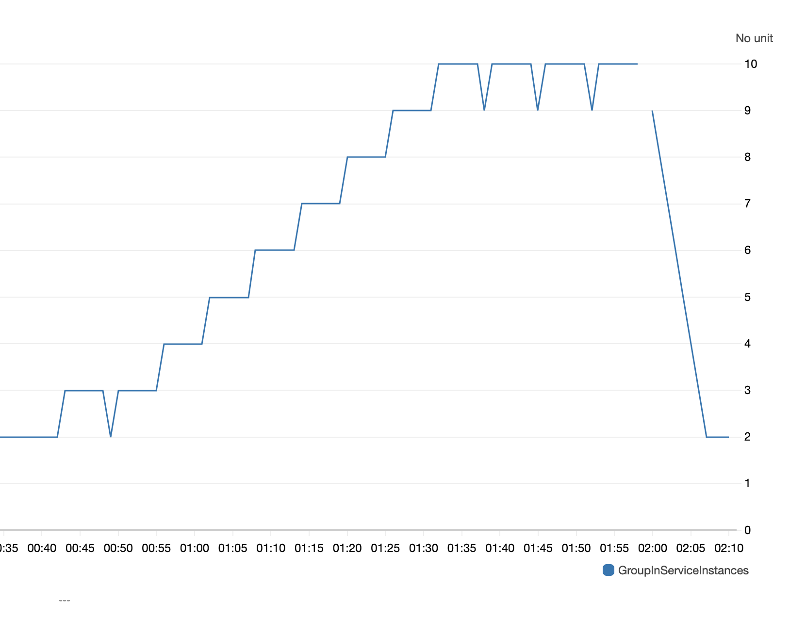
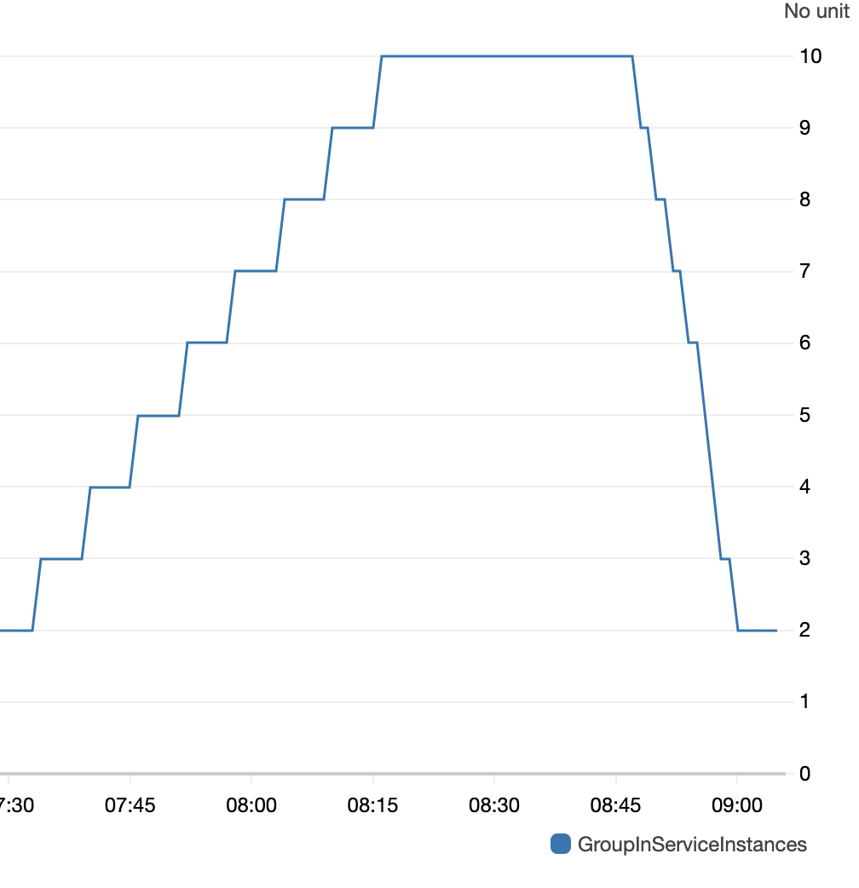

# GAS Framework
An enhanced web framework (based on [Flask](https://flask.palletsprojects.com/)) for use in the capstone project. Adds robust user authentication (via [Globus Auth](https://docs.globus.org/api/auth)), modular templates, and some simple styling based on [Bootstrap](https://getbootstrap.com/docs/3.3/).

Directory contents are as follows:
* `/web` - The GAS web app files
* `/ann` - Annotator files
* `/util` - Utility scripts/apps for notifications, archival, and restoration
* `/aws` - AWS user data files

# Archive & Restore Logic:

**Archive:** When a user's job is finished, a message containing its `job_id`, `user_id`, `GasFreeUserDownloadTimeFrameSec`, and `s3_result_key` will be sent to a AWS Step Function. Upon time countdown (300 seconds) finishes, the message will be sent to a SNS archive topic, which is listened to by a archive SQS. This SQS is then read by archive.py, which processes the message and ONLY archives files whose owner is a `free_user`, using `glacier.upload_archive()`. Each job to be archived will be updated with a new column called `results_file_archive_id` on its dynamoDB record. The result file on S3 is also deleted explicitly. Note: `results_file_archive_id` column contains the archival ID returned by glacier.upload_archive(). 

**Restore:** When a user upgrades to premium, views.py sends a message containing a `user_id` (`user_id_to_thaw`) to thaw_topic, which then was listened to by a thaw SQS. The utility script thaw.py retrieves messages from this SQS, and calls `glacier.initiate_job()` for every `job_id` under the user `user_id_to_thaw`, using its corresponding `results_file_archive_id` value stored in Dynamo. The script will attempt to initiate an expedited retrieval; if expedited retrieval is not successful, a standard retrieval will be initiated. When retrieval job is finished, it is configured to send a message to SNS topic results_restore, which is being listened to by AWS Lambda function. The annotation `job_id` is passed to Lambda via the description field of the parameters, so that the lambda function can use the ann job ID to query relevant information on Dynamo. Note: Record of the job on dynamo db will be updated with a `thaw_job_id` after a retrieval job is initiated (job ID returned by glacier.initiate_job()).
A Lambda function triggered by this SNS topic will process the event message, which includes `results_file_archive_id`, `thaw_job_id`, and `ann_job_id`. With these info, it can read from Dynamo, read from the archive, upload the file to the corresponding S3_key, delete the archive, and finally restore its DB record by removing the two columns: `thaw_job_id` and `results_file_archive_id`. 

**Edge Case Handling:** In particular, my approach also covers the edge case when user upgrades to premium while his/her jobs are still running. In my approach, my thaw.py only attempts to thaw jobs that have the column `results_file_archive_id`; this means that only finished jobs that have been archived will contain this column and jobs running in progress would not.

# Web ELB Auto Scaling Analysis 

**Scale out behavior:** I used Locust with configuration of 200 users and 25 requests/second to load test my webserver ELB. My ELB scale-out policy is set so that if `request count` is greater than 200 for 60 consecutive seconds, then alarm will be triggered. In addition, there is a 300 seconds (5 minutes) cooldown before appending another new instance. Thus, as you can see in the graph, new instances were added roughly every 5 minutes due to our cooldown setting. However, noticeably there are also instances where the count drops and bounces back, i.e. at count = 3 and 10. My speculation is that the sudden drop in instance count was caused by our scale-in policy, which will be explained next.

**Scale in behavior:** My ELB scale-in policy is configured to be triggered whenever `TargetResponseTime` is less than 10 ms for the past consecutive 60 seconds. Thus, once the locust program is terminated (at timestamp 01:58 in the screenshot), you can tell from the graph that the scale-in behavior becomes evident. As the target response time becomes lower (since there was very less, if not little, requests to the gas endpoint) the instance count steadily decrements at interval of 1 minutes since the alarm is triggered every 60 seconds and we do not have the cooldown termination as the scale-out policy. In addition, my treatment to missing data is to maintain in the alarm state, meaning that scale-in will be in effect in the case of insufficient data. This is the expected behavior since no data means no traffic, and our web server farm should shrink in this regard.

Moreover, to explain the sudden drop in count during the scale-out process, we can turn our attention to the nature of target response rate in a large distributed system. As we can infer, target response time, unlike endpoint request counts, can fluctuate rapidly throughout the day depending on one's internet connection or location proximity to nearby AWS data center, etc, given that AWS itself is a large-scaled distributed system. Thus, when the overall system has less traffic/usages, target response time can become small thus breaching the 10 ms threshold we configured, and there can be many factors that lead to such case. Therefore, I believe these system fluctations are the primary causes that lead to those unexpected termination of instances even when Locust is at work.

# Annotator Farm Auto Scaling Analysis 

Note: In order for `ann_load.py` to run and submit jobs successfully, please put `test.vcf` in the same directory as `ann_load.py`.

**Scale out behavior:** My annotator farm scale-out policy is triggered if `NumberOfMessagesSent` is greater than 50 for the past 600 consecutive seconds. Thus, in the left half of the graph, we can see that the instance counts increases steadily every 5 minutes. This is due to the fact that I set the wait time (cooldown) to be 300 seconds before the policy fires up another scaling activity. Once the instance counts reaches 10, it wouldn't increase because we set the maximum number of instance to be 10 - It remains at count of 10 until the `ann_load.py` script is terminated. There is also no sudden drop in instance count as we've seen in the web-sacler because the metric `NumberOfMessagesSent` is not fluctating as `TargetResponseTime`.

**Scale in behavior:** My scale-in policy is triggered whenever `NumberOfMessagesSent` is less than 5 for the past 600 consecutive seconds. Once the `ann_load.py` script is terminated (at around 08:47 timestamp), the instance count begins to drop as the scale-in policy kicks in. The scale-in policy takes into effect at roughly every minute, as opposed to every 5 minute as ann-scale-out policy because it does not have a cooldown configuration. The instance count kept decrementing roughly every minute until it reaches 2, which is the minimum number of instances we configured annotator farms to have.# GenomeAnnotationService
# GenomeAnnotationService
